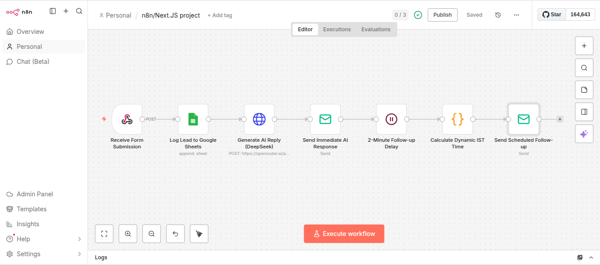

# 🤖 n8n + Next.js: AI-Powered Contact Automation 🚀

   

An enterprise-grade, full-stack automation engine that bridges a modern **Next.js 14** frontend with a robust **n8n** orchestration backend. Designed to handle lead capture, data persistence, AI communication, and localized follow-up logic.

---

## 📸 System Architecture


---

## 🎯 Purpose & Problem Solved

### **The Problem**
Small and medium businesses often lose **60% of potential leads** due to slow response times (Lead Decay). Manual data entry into CRMs leads to human error, and inconsistent follow-up schedules result in missed conversion opportunities. 

### **The Solution**
This system provides an **automated, asynchronous pipeline** that:
1.  **Eliminates Latency:** Responds to users instantly using AI.
2.  **Zero Manual Entry:** Automatically logs leads into a centralized database (Google Sheets).
3.  **Human-Like Persistence:** Executes a timed, multi-phase follow-up strategy.
4.  **Local Context:** Uses custom JavaScript logic to deliver timestamps in the user's local timezone (**IST**).

---

## ✨ Key Features

*   **🌐 Modern Lead Capture:** Responsive form built with **Next.js 14** and **Tailwind CSS**.
*   **🧠 Intelligence Engine:** Powered by **DeepSeek-V3** via **OpenRouter** to generate context-aware, professional replies.
*   **✉️ Dual-Phase Engagement:** 
    *   *Phase 1:* Immediate AI response via **SMTP (Mailtrap)**.
    *   *Phase 2:* 2-minute delayed follow-up to simulate human review.
*   **🕒 Dynamic Timezone Logic:** A specialized **n8n Code Node (JavaScript)** calculates the exact moment of delivery in `Asia/Kolkata` format.
*   **📊 CRM Integration:** Real-time data streaming to **Google Sheets API** for persistent lead tracking.
*   **🔐 Production Security:** Secured via **Vercel Environment Variables** and Webhook protection.

---

## 🚀 Technical Stack

| Layer | Technology |
| :--- | :--- |
| **Frontend** | Next.js 14 (React, Tailwind CSS) |
| **Hosting** | Vercel (CI/CD via GitHub) |
| **Automation** | n8n Orchestration |
| **AI / LLM** | DeepSeek-V3 (OpenRouter API) |
| **Data / Storage** | Google Sheets API |
| **Logic** | Node.js / JavaScript (n8n Code Node) |
| **Email** | SMTP Protocol (Mailtrap for testing) |

---

## ⚙️ Advanced Implementation Details

### **Scalability & Performance**
Designed to handle thousands of records by utilizing n8n's asynchronous webhook processing. For higher loads, the architecture supports splitting into **Sub-workflows** to prevent memory blowups.

### **Reliability & Idempotency**
The system is built to prevent duplicate processing. By generating a unique `timestamp` at the frontend, the n8n backend can implement check-logic to ensure each lead is only emailed and logged once.

### **Custom JavaScript Logic**
To satisfy strict timezone requirements, I bypassed standard nodes in favor of a **JavaScript Code Node** to ensure time is calculated at the exact moment of execution:
```javascript
const istTime = DateTime.now().setZone('Asia/Kolkata').toFormat('yyyy-MM-dd HH:mm:ss');
return { currentTimeIST: istTime };
---

## 🛠️ Setup and Installation

### 1. Frontend Setup (Vercel)
1. Clone this repository.
2. Deploy to Vercel.
3. Add the Environment Variable: `NEXT_PUBLIC_N8N_WEBHOOK_URL` = `Your_n8n_Production_Webhook_URL`

### 2. n8n Workflow Setup
1. Import the `.json` workflow file provided in this repo.
2. **Configure Credentials:** Google Sheets, OpenRouter (Header Auth), and SMTP (Mailtrap).
3. **Activate:** Toggle the workflow to **Active**.

---

## ✍️ Author
**Muneeb Ali Khan**
*   **GitHub:** [@Muneeb2019](https://github.com/Muneeb2019)
*   **LinkedIn:** [Muneeb Ali Khan](https://www.linkedin.com/in/muneeb-ali-khan-2a1675365)
*   **Live Demo:** [Vercel Deployment](https://full-stack-project-rosy.vercel.app)


